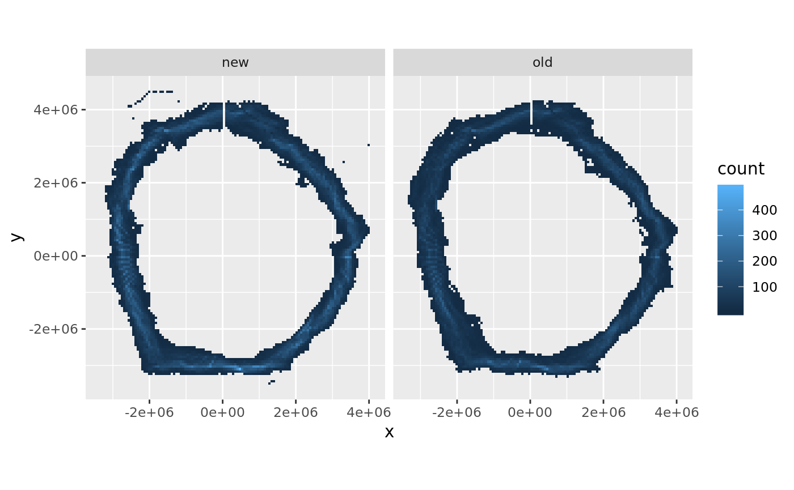

<!-- README.md is generated from README.Rmd. Please edit that file -->
sospatial
=========

The goal of sospatial is to provide some easy to use Southern Ocean data sets for mapping and exploration in R.

We aim to fill some existing gaps where (especially) mapping in polar regions causes difficulties.

Example
-------

This example shows the used of the `packed_lats` cache to draw a rough map of the intensity of where the daily sea ice extent was in the Southern Ocean.

WIP - when this data set is fully spatially and temporally referenced we can use it to extract abstract metrics like "max sea ice extent", which might mean the major 'edge' on the day of greatest extent, or the cumulatively most-northerly location at all longitudes during a year ...

``` r
## reconstruct record
library(dplyr)
#> 
#> Attaching package: 'dplyr'
#> The following objects are masked from 'package:stats':
#> 
#>     filter, lag
#> The following objects are masked from 'package:base':
#> 
#>     intersect, setdiff, setequal, union
library(sospatial)
ice <- tibble(lon = rep_len(seq(-180, 179), length.out = length(packed_lats)), 
              lat = packed_lats/10,
              day = rep(ice_dates, each = 360))

ice[c("x", "y")] <- rgdal::project(as.matrix(ice[c("lon", "lat")]), "+proj=stere +lat_0=-90 +datum=WGS84")
library(ggplot2)
ggplot(ice, aes(x, y)) + geom_bin2d() + coord_equal()
#> Warning: Removed 12538 rows containing non-finite values (stat_bin2d).
```


``` r

# what does a month look like
mon <- ice %>% dplyr::filter(format(day, "%m") == "08")
ggplot(mon, aes(x, y)) + geom_bin2d() + coord_equal() + xlim(range(mon$x)) + ylim(range(mon$y))
#> Warning: Removed 1074 rows containing non-finite values (stat_bin2d).
#> Warning: Removed 2 rows containing missing values (geom_tile).
```


``` r

mon$era <- c("old", "new")[(mon$day > as.POSIXct("1998-06-15")) + 1]
ggplot(mon, aes(x, y)) + 
  geom_bin2d() + coord_equal() + xlim(range(mon$x)) + ylim(range(mon$y)) + 
  facet_wrap(~era)
#> Warning: Removed 1074 rows containing non-finite values (stat_bin2d).
#> Warning: Removed 4 rows containing missing values (geom_tile).
```



Conduct
=======

Please note that this project is released with a [Contributor Code of Conduct](CONDUCT.md). By participating in this project you agree to abide by its terms.
