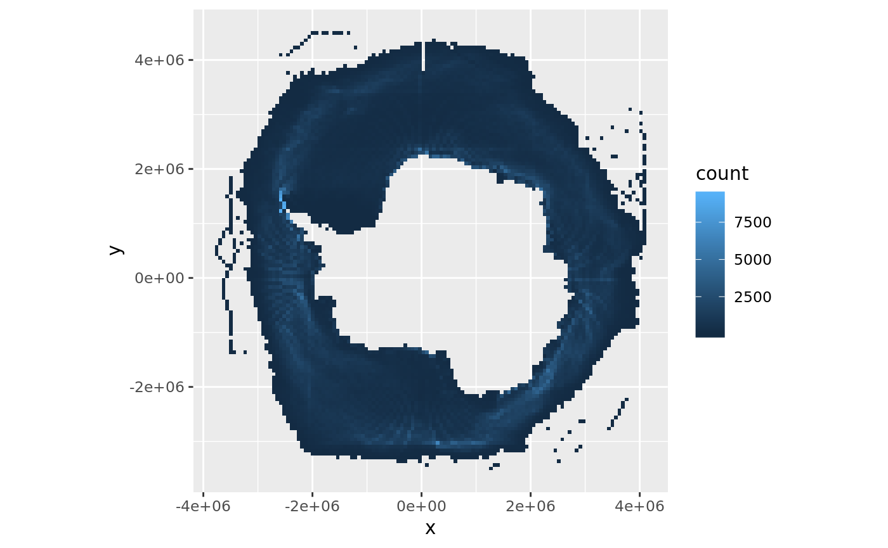
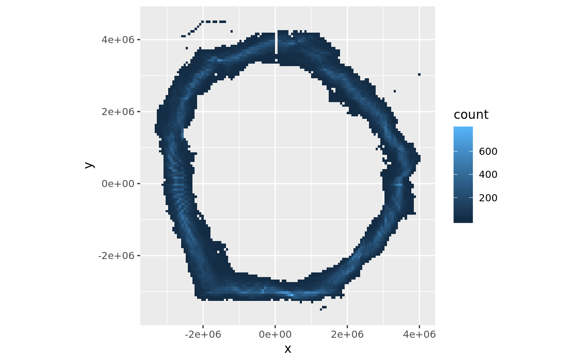
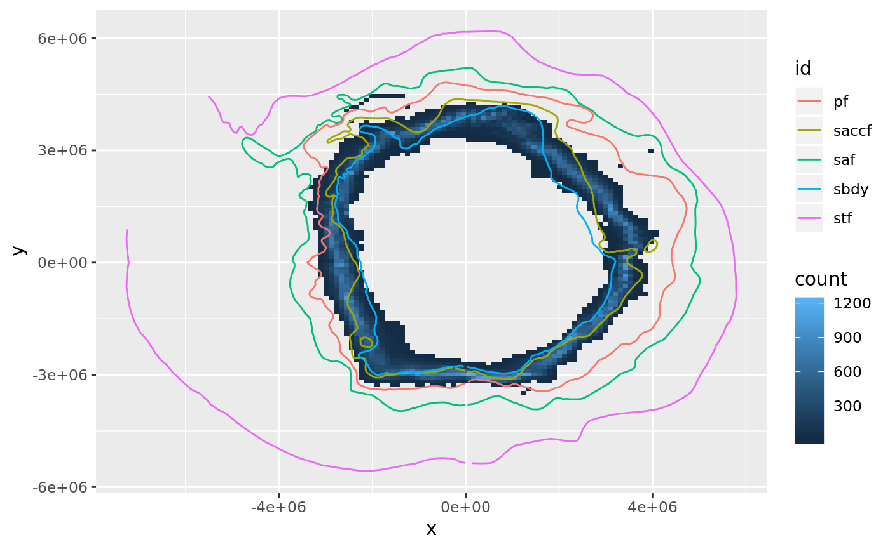

<!-- README.md is generated from README.Rmd. Please edit that file -->
sospatial
=========

The goal of sospatial is to provide some easy to use Southern Ocean data sets for mapping and exploration in R.

We aim to fill some gaps that make mapping in polar regions more difficult that usual.

Example
-------

This example shows the used of the `packed_lats` cache to draw a rough map of the intensity of where the daily sea ice extent was in the Southern Ocean.

WIP - when this data set is fully spatially and temporally referenced we can use it to extract abstract metrics like "max sea ice extent", which might mean the major 'edge' on the day of greatest extent, or the cumulatively most-northerly location at all longitudes during a year ...

``` r
## reconstruct record
library(dplyr)
#> 
#> Attaching package: 'dplyr'
#> The following objects are masked from 'package:stats':
#> 
#>     filter, lag
#> The following objects are masked from 'package:base':
#> 
#>     intersect, setdiff, setequal, union
library(sospatial)
ice <- tibble(lon = rep_len(seq(-180, 179), length.out = length(packed_lats)), 
              lat = packed_lats/10,
              day = rep(ice_dates, each = 360))
prjstere <- "+proj=stere +lat_0=-90 +datum=WGS84"
ice[c("x", "y")] <- rgdal::project(as.matrix(ice[c("lon", "lat")]), prjstere)
library(ggplot2)
ggplot(ice, aes(x, y)) + geom_bin2d(bins = 120) + coord_equal()
#> Warning: Removed 12908 rows containing non-finite values (stat_bin2d).
```



``` r

# what does a month look like
mon <- ice %>% dplyr::filter(format(day, "%m") == "08")
ggplot(mon, aes(x, y)) + geom_bin2d(bins = 120) + coord_equal() + xlim(range(mon$x)) + ylim(range(mon$y))
#> Warning: Removed 1106 rows containing non-finite values (stat_bin2d).
#> Warning: Removed 2 rows containing missing values (geom_tile).
```



``` r


mon$era <- c("old", "new")[(mon$day > as.POSIXct("1998-06-15")) + 1]
ggplot(mon, aes(x, y)) + 
  geom_bin2d(bins = 120) + coord_equal() + xlim(range(mon$x)) + ylim(range(mon$y)) + 
  facet_wrap(~era)
#> Warning: Removed 1106 rows containing non-finite values (stat_bin2d).

#> Warning: Removed 2 rows containing missing values (geom_tile).
```


``` r


## add the fronts 
library(orsifronts)
#> Loading required package: sp
library(dplyr)
fronts <- ggplot2::fortify(sp::spTransform(orsifronts, prjstere))

ggplot(mon, aes(x, y)) + geom_bin2d(bins = 120) + geom_path(data = fronts, aes(long, lat, group = group, colour = id))
#> Warning: Removed 1106 rows containing non-finite values (stat_bin2d).
```



``` r

## get a coastline
cst <- fortify(sp::spTransform(rnaturalearth::ne_coastline(), prjstere))
ggplot(mon, aes(x, y)) + geom_bin2d(bins = 120) + geom_path(data = fronts, aes(long, lat, group = group, colour = id)) + geom_path(data = cst, aes(long, lat, group = group)) + 
  xlim(range(fronts$long)) + ylim(range(fronts$lat))
#> Warning: Removed 1106 rows containing non-finite values (stat_bin2d).
#> Warning: Removed 4056 rows containing missing values (geom_path).
```


Pull out a specific summary line, say the maximum latitude per longitude for any day in October in the last ten years.

This is a bit of a dummy example, but is the kind of task that we hope to make easier so that these basic summaries can be produced by anyone.

``` r
oct <-  ice %>% 
  dplyr::filter(day > as.POSIXct("2007-01-01"), format(day, "%m") == "10") %>% 
  filter(!is.na(lat)) %>% 
  group_by(lon) %>% 
  summarize(lat = max(lat)) 

## construct that as a line, and a polygon
library(sf)
#> Linking to GEOS 3.5.1, GDAL 2.2.2, proj.4 4.9.2
line <- st_sf(geometry = st_sfc(st_linestring(cbind(oct$lon, oct$lat)), crs = 4326), 
              name = "october_max_2007_2017")

poly <- st_sf(geometry = st_polygonize(st_transform(st_sfc(st_linestring(cbind(oct$lon, oct$lat)[c(1:nrow(oct), 1), ]), crs = 4326), prjstere)), 
              name = "october_max_2007_2017")

plot(st_geometry(line))
plot(orsifronts, add = TRUE, col = "firebrick")
```


``` r
plot(st_geometry(poly))
```


``` r

## area is a placeholder here, obviously we need to cut out the continent
## and any polynas
## area in stere
st_area(poly)
#> 4.181186e+13 m^2
## (more) true area
## note that this is more like what st_area will give for a longlat dataset
## since stereographic is not area-preserving and laea will be more faithful
## the ellipsoidal methods used for longlat
st_area(st_transform(poly, "+proj=laea +lat_0=-90 +datum=WGS84"))
#> 3.853668e+13 m^2
```

Conduct
=======

Please note that this project is released with a [Contributor Code of Conduct](CONDUCT.md). By participating in this project you agree to abide by its terms.
